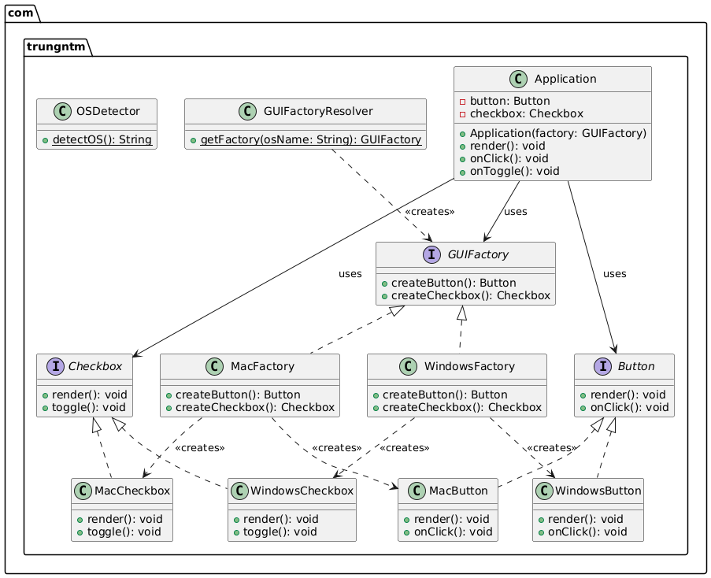

# Abstract Factory Pattern

## Purpose

The Abstract Factory pattern is a creational design pattern that provides an interface for creating families of related or dependent objects without specifying their concrete classes. It encapsulates a group of individual factories that have a common theme, allowing the client code to create objects without knowing the specific classes being instantiated.

### Key Benefits:
- **Consistency**: Ensures that products from the same family are used together
- **Flexibility**: Easy to switch between different product families
- **Isolation**: Separates client code from concrete product classes
- **Extensibility**: New product families can be added without modifying existing code

## Real-World Use Cases

### 1. **Cross-Platform GUI Applications**
- Creating UI components (buttons, checkboxes, menus) for different operating systems
- Each OS has its own look and feel, but the same functionality
- Example: Windows, macOS, Linux GUI components

### 2. **Database Connectivity**
- Different database drivers (MySQL, PostgreSQL, Oracle)
- Each database has specific connection, statement, and result set implementations
- Client code remains database-agnostic

### 3. **Game Development**
- Different themes or environments (Medieval, SciFi, Fantasy)
- Each theme has its own set of characters, weapons, and environments
- Consistent visual style within each theme

### 4. **Document Processing**
- Different document formats (PDF, Word, HTML)
- Each format has specific parsers, formatters, and exporters
- Unified interface for document operations

### 5. **E-commerce Platforms**
- Different payment gateways (PayPal, Stripe, Square)
- Each gateway has specific payment, refund, and validation implementations
- Consistent payment processing interface

## Sample Implementation

This implementation demonstrates a cross-platform GUI factory that creates UI components for different operating systems.

### Class Structure:

#### Abstract Factory Interface
```java
public interface GUIFactory {
    Button createButton();
    Checkbox createCheckbox();
}
```

#### Product Interfaces
```java
public interface Button {
    void render();
    void onClick();
}

public interface Checkbox {
    void render();
    void toggle();
}
```

#### Concrete Factories
- `MacFactory`: Creates macOS-specific UI components
- `WindowsFactory`: Creates Windows-specific UI components

#### Concrete Products
- `MacButton`, `MacCheckbox`: macOS implementations
- `WindowsButton`, `WindowsCheckbox`: Windows implementations

### Usage Example:
```java
public class Application {
    private Button button;
    private Checkbox checkbox;
    
    public Application(GUIFactory factory) {
        button = factory.createButton();
        checkbox = factory.createCheckbox();
    }
    
    public void render() {
        button.render();
        checkbox.render();
    }
}

// Client code
GUIFactory factory;
String osName = System.getProperty("os.name").toLowerCase();
if (osName.contains("mac")) {
    factory = new MacFactory();
} else {
    factory = new WindowsFactory();
}

Application app = new Application(factory);
app.render();
```

## UML Diagram



## Pattern Structure

### Components:

1. **Abstract Factory (GUIFactory)**: Declares methods for creating abstract products
2. **Concrete Factory (MacFactory, WindowsFactory)**: Implements operations to create concrete products
3. **Abstract Product (Button, Checkbox)**: Declares interfaces for product objects
4. **Concrete Product (MacButton, WindowsButton, etc.)**: Implements the abstract product interface
5. **Client (Application)**: Uses only interfaces declared by Abstract Factory and Abstract Product

## When to Use

✅ **Use Abstract Factory when:**
- Your system needs to be independent of how its products are created
- You need to configure your system with one of multiple families of products
- A family of related product objects is designed to be used together
- You want to provide a class library of products and reveal only their interfaces

❌ **Avoid Abstract Factory when:**
- You only have one product family
- The product families rarely change
- The complexity overhead isn't justified by the flexibility gained

## Advantages & Disadvantages

### Advantages:
- ✅ Isolates concrete classes
- ✅ Makes exchanging product families easy
- ✅ Promotes consistency among products
- ✅ Supports Open/Closed Principle

### Disadvantages:
- ❌ Can be difficult to extend with new kinds of products
- ❌ Increases code complexity
- ❌ May lead to unnecessary abstraction if only one product family exists

The application will automatically detect your operating system and create the appropriate UI components (Mac or Windows style).
