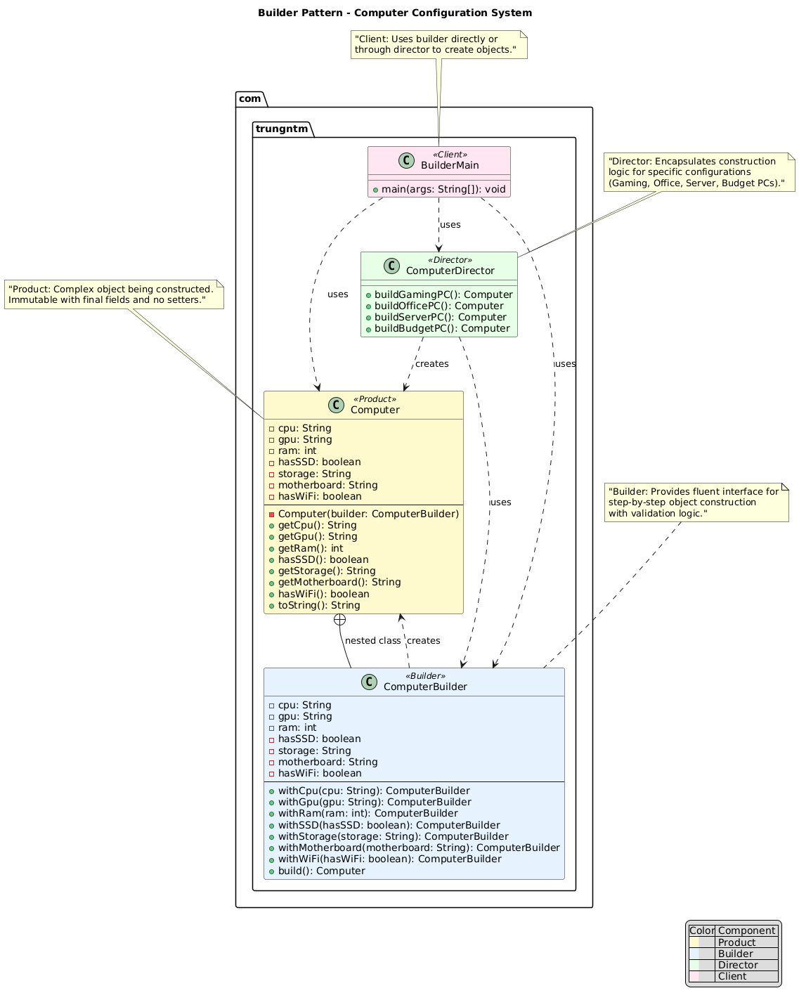

# Builder Pattern

## Purpose

The Builder pattern is a *creational* design pattern that provides a flexible solution for constructing complex objects step by step. It allows you to create different types and representations of an object using the same construction code.

The Builder pattern is particularly useful when dealing with objects that have many optional parameters or when the construction process must allow different representations of the object being constructed.

### Key Benefits:
- **Flexibility**: Construct objects step-by-step with optional parameters
- **Readability**: Method chaining provides clear, readable code
- **Immutability**: Can create immutable objects without telescoping constructors
- **Validation**: Centralized validation logic during object construction
- **Reusability**: Same builder can create different representations

## Components of Builder Pattern

### 1. **Product**
The complex object being constructed.

### 2. **Builder Interface** (Optional)
Declares the construction steps that are common to all builders.

### 3. **Concrete Builder**
Implements the construction steps and provides methods to retrieve the result.

### 4. **Director** (Optional)
Defines the order in which construction steps are called to create specific product configurations.

### 5. **Client**
Uses the builder to construct objects step by step.

## Real-World Use Cases

### 1. **Computer Configuration**
- Building computers with different specifications (CPU, GPU, RAM, Storage)
- Each configuration has mandatory and optional components
- Example: Gaming PC, Office PC, Server configurations

### 2. **SQL Query Building**
- Constructing complex SQL queries with optional clauses
- SELECT, FROM, WHERE, JOIN, ORDER BY, GROUP BY clauses
- Dynamic query building based on user input

### 3. **Document Generation**
- Creating documents with different sections and formatting
- Headers, footers, content blocks, styling options
- Example: PDF reports, HTML pages, Word documents

### 4. **Configuration Objects**
- Application settings with numerous optional parameters
- Database connections with various configuration options
- HTTP client configurations with timeouts, headers, authentication

### 5. **UI Component Building**
- Creating complex UI components with many styling options
- Dialogs, forms, charts with customizable properties
- Example: Alert dialogs, data tables, navigation menus

## Programming Example

Imagine building a computer system where you need to specify various components like CPU, GPU, RAM, and storage options. Without the Builder pattern, you'd need multiple constructors or a constructor with many parameters, making it hard to read and maintain.

The Builder pattern allows you to construct computers step-by-step with a fluent, readable API.

### Class Structure:

#### Product Class
```java
public class Computer {
    private String cpu;
    private String gpu;
    private int ram;
    private boolean hasSSD;
    private String storage;
    private String motherboard;
    private boolean hasWiFi;

    private Computer(ComputerBuilder builder) {
        this.cpu = builder.cpu;
        this.gpu = builder.gpu;
        this.ram = builder.ram;
        this.hasSSD = builder.hasSSD;
        this.storage = builder.storage;
        this.motherboard = builder.motherboard;
        this.hasWiFi = builder.hasWiFi;
    }

    // Getters only (immutable object)
    public String getCpu() { return cpu; }
    public String getGpu() { return gpu; }
    public int getRam() { return ram; }
    public boolean hasSSD() { return hasSSD; }
    public String getStorage() { return storage; }
    public String getMotherboard() { return motherboard; }
    public boolean hasWiFi() { return hasWiFi; }

    @Override
    public String toString() {
        return "Computer{" +
            "cpu='" + cpu + '\'' +
            ", gpu='" + gpu + '\'' +
            ", ram=" + ram + "GB" +
            ", storage='" + storage + '\'' +
            ", motherboard='" + motherboard + '\'' +
            ", hasSSD=" + hasSSD +
            ", hasWiFi=" + hasWiFi +
            '}';
    }
}
```

#### Concrete Builder
```java
public static class ComputerBuilder {
    private String cpu;
    private String gpu;
    private int ram;
    private boolean hasSSD = false;
    private String storage = "500GB HDD";
    private String motherboard;
    private boolean hasWiFi = false;

    public ComputerBuilder withCpu(String cpu) {
        this.cpu = cpu;
        return this;
    }

    public ComputerBuilder withGpu(String gpu) {
        this.gpu = gpu;
        return this;
    }

    public ComputerBuilder withRam(int ram) {
        this.ram = ram;
        return this;
    }

    public ComputerBuilder withSSD(boolean hasSSD) {
        this.hasSSD = hasSSD;
        if (hasSSD && storage.contains("HDD")) {
            this.storage = storage.replace("HDD", "SSD");
        }
        return this;
    }

    public ComputerBuilder withStorage(String storage) {
        this.storage = storage;
        return this;
    }

    public ComputerBuilder withMotherboard(String motherboard) {
        this.motherboard = motherboard;
        return this;
    }

    public ComputerBuilder withWiFi(boolean hasWiFi) {
        this.hasWiFi = hasWiFi;
        return this;
    }

    public Computer build() {
        // Validation logic
        if (cpu == null || cpu.trim().isEmpty()) {
            throw new IllegalStateException("CPU is required");
        }
        if (ram <= 0) {
            throw new IllegalStateException("RAM must be positive");
        }
        if (motherboard == null || motherboard.trim().isEmpty()) {
            throw new IllegalStateException("Motherboard is required");
        }
        
        return new Computer(this);
    }
}
```

#### Director Class (Optional)
```java
public class ComputerDirector {
    
    public static Computer buildGamingPC() {
        return new Computer.ComputerBuilder()
            .withCpu("Intel i9-13900K")
            .withGpu("NVIDIA RTX 4090")
            .withRam(32)
            .withMotherboard("ASUS ROG Strix Z790")
            .withStorage("2TB NVMe SSD")
            .withSSD(true)
            .withWiFi(true)
            .build();
    }
    
    public static Computer buildOfficePC() {
        return new Computer.ComputerBuilder()
            .withCpu("Intel i5-13400")
            .withGpu("Intel UHD Graphics")
            .withRam(16)
            .withMotherboard("MSI B760M")
            .withStorage("512GB SSD")
            .withSSD(true)
            .withWiFi(true)
            .build();
    }
    
    public static Computer buildServerPC() {
        return new Computer.ComputerBuilder()
            .withCpu("AMD EPYC 7763")
            .withRam(128)
            .withMotherboard("Supermicro H12SSL")
            .withStorage("4TB Enterprise SSD")
            .withSSD(true)
            .withWiFi(false)
            .build();
    }
}
```

#### Example Usage:
```java
public class BuilderMain {
    public static void main(String[] args) {
        // Building custom computer step by step
        Computer customComputer = new Computer.ComputerBuilder()
            .withCpu("Intel i7-13700K")
            .withGpu("NVIDIA RTX 4070")
            .withRam(32)
            .withMotherboard("ASUS TUF Gaming Z790")
            .withSSD(true)
            .withStorage("1TB NVMe SSD")
            .withWiFi(true)
            .build();

        System.out.println("Custom Computer: " + customComputer);

        // Using director for predefined configurations
        Computer gamingPC = ComputerDirector.buildGamingPC();
        Computer officePC = ComputerDirector.buildOfficePC();
        Computer serverPC = ComputerDirector.buildServerPC();

        System.out.println("Gaming PC: " + gamingPC);
        System.out.println("Office PC: " + officePC);
        System.out.println("Server PC: " + serverPC);
    }
}
```

## UML Diagram



## Pattern Structure

### Components:

1. **Product (Computer)**: The complex object being constructed
2. **Builder (ComputerBuilder)**: Provides methods to build the product step by step
3. **Director (ComputerDirector)**: Optional class that defines construction order for specific configurations
4. **Client (BuilderMain)**: Uses the builder to construct objects

## When to Use

✅ **Use Builder when:**
- Creating objects with many optional parameters (avoiding telescoping constructors)
- You need different representations of the same object
- The construction process must allow different configurations
- You want to create immutable objects with complex initialization
- Construction logic is complex and should be separated from representation

❌ **Avoid Builder when:**
- The object has few parameters (2-3 parameters)
- The construction process is simple and unlikely to change
- You don't need different representations of the object
- Performance is critical and object creation overhead matters

## Advantages & Disadvantages

### Advantages:
- ✅ Eliminates telescoping constructors
- ✅ Allows step-by-step object construction
- ✅ Enables creation of immutable objects
- ✅ Provides better control over construction process
- ✅ Code is more readable and maintainable
- ✅ Supports method chaining for fluent interface

### Disadvantages:
- ❌ Increases code complexity for simple objects
- ❌ Requires creating additional builder classes
- ❌ May lead to partially constructed objects if not used properly
- ❌ More memory usage due to builder instances

The Builder pattern provides a clean, readable way to construct complex objects while maintaining flexibility and ensuring object integrity through validation.
