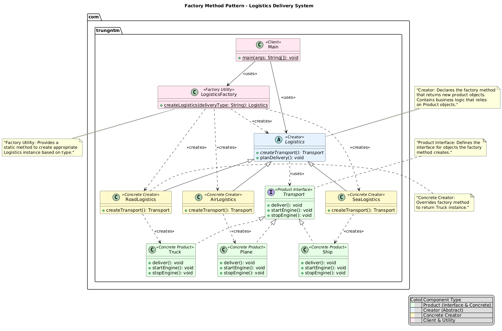

# Factory Method Pattern

## Purpose

The Factory Method pattern is a *creational* design pattern that provides an interface for creating objects in a superclass, but **allows subclasses to alter the type of objects that will be created**. Instead of calling a constructor directly, the pattern delegates object creation to a special factory method.

Unlike the Abstract Factory (which creates families of products), the Factory Method is used to delegate the instantiation of a single object to subclasses.

### Key Benefits:
- **Decoupling**: Separates object creation from the code that uses the objects
- **Flexibility**: Easy to introduce new types of products without breaking existing code
- **Single Responsibility**: Moves product creation code to one place in the program
- **Open/Closed Principle**: Code is open for extension but closed for modification

## Real-World Use Cases

### 1. **Logistics and Transportation**
- Different delivery methods (road, sea, air transportation)
- Each method creates specific transport vehicles
- Business logic remains the same regardless of transport type
- Example: Shipping companies with multiple delivery options

### 2. **Document Processing**
- Different document types (PDF, Word, Excel, PowerPoint)
- Each type has specific parsers and generators
- Unified interface for document operations
- Example: Office suites creating various document formats

### 3. **Database Connections**
- Different database types (MySQL, PostgreSQL, Oracle, SQLite)
- Each database requires specific connection implementations
- Same interface for all database operations
- Example: ORM frameworks supporting multiple databases

### 4. **UI Component Creation**
- Different UI frameworks (Swing, JavaFX, Android, Web)
- Each framework creates platform-specific components
- Consistent component behavior across platforms
- Example: Cross-platform mobile applications

### 5. **Gaming Systems**
- Different enemy types or character classes
- Each type has specific creation logic and behaviors
- Game engine remains unchanged when adding new types
- Example: RPG games with various character classes

### 6. **Notification Systems**
- Different notification channels (Email, SMS, Push, Slack)
- Each channel has specific implementation requirements
- Unified notification sending interface
- Example: Multi-channel marketing platforms

## Sample Implementation

This implementation demonstrates a logistics system that can handle different types of transportation methods.

### Class Structure:

#### Product Interface
```java
public interface Transport {
    void deliver();
    void startEngine();
    void stopEngine();
}
```

#### Concrete Products
- `Truck`: Land-based transportation
- `Ship`: Sea-based transportation  
- `Plane`: Air-based transportation

#### Creator (Factory) Abstract Class
```java
public abstract class Logistics {
    // Factory method - subclasses implement this
    public abstract Transport createTransport();
    
    // Business logic using the factory method
    public void planDelivery() {
        Transport transport = createTransport();
        transport.startEngine();
        transport.deliver();
        transport.stopEngine();
    }
}
```

#### Concrete Creators
- `RoadLogistics`: Creates trucks for land delivery
- `SeaLogistics`: Creates ships for sea delivery
- `AirLogistics`: Creates planes for air delivery

### Logistics Factory Registry

```java
// Factory Registry for managing different creators
public class LogisticsFactory {

  public static Logistics createLogistics(String deliveryType) {
    return switch (deliveryType) {
      case "road" -> new RoadLogistics();
      case "sea" -> new SeaLogistics();
      case "air" -> new AirLogistics();
      default -> new RoadLogistics();
    };
  }
}
```

### Usage Example:
```java
public class Main {
    public static void main(String[] args) {
        // Choose logistics type based on business requirements
        Logistics logistics;
        
        String deliveryType = getDeliveryType(); // Could come from config/user input
        
        switch (deliveryType) {
            case "road":
                logistics = new RoadLogistics();
                break;
            case "sea":
                logistics = new SeaLogistics();
                break;
            case "air":
                logistics = new AirLogistics();
                break;
            default:
                logistics = new RoadLogistics();
        }
        
        // Client code works with any logistics type
        logistics.planDelivery();
    }
}
```

## UML Diagram



## Pattern Structure

### Components:

1. **Product (Transport)**: Declares the interface for objects the factory method creates
2. **Concrete Product (Truck, Ship, Plane)**: Implements the Product interface
3. **Creator (Logistics)**: Declares the factory method that returns Product objects
4. **Concrete Creator (RoadLogistics, SeaLogistics, AirLogistics)**: Overrides the factory method to return specific Concrete Product instances

### Key Differences from Abstract Factory:

| Factory Method | Abstract Factory |
|----------------|------------------|
| Creates **one type** of product | Creates **families** of related products |
| Uses **inheritance** (subclassing) | Uses **composition** (object creation) |
| **Single factory method** per creator | **Multiple factory methods** per factory |
| Focuses on **one product hierarchy** | Handles **multiple product hierarchies** |

## When to Use

✅ **Use Factory Method when:**
- You don't know beforehand the exact types of objects your code should work with
- You want to provide a way to extend internal components of a framework/library
- You want to save system resources by reusing existing objects instead of rebuilding them
- You need to delegate object creation to subclasses

❌ **Avoid Factory Method when:**
- Object creation is simple and doesn't vary
- You only have one concrete product type
- The pattern would add unnecessary complexity
- Direct instantiation is more appropriate

## Advantages & Disadvantages

### Advantages:
- ✅ Eliminates tight coupling between creator and concrete products
- ✅ Follows Single Responsibility Principle
- ✅ Follows Open/Closed Principle
- ✅ Easy to extend with new product types
- ✅ Centralizes object creation logic

### Disadvantages:
- ❌ Code can become more complex due to new subclasses
- ❌ Requires creating a new concrete creator class for each new product type
- ❌ May be overkill for simple object creation scenarios

## Comparison with Other Patterns

### Factory Method vs Simple Factory
- **Factory Method**: Uses inheritance, follows Open/Closed Principle
- **Simple Factory**: Uses composition, requires modification for new types

### Factory Method vs Abstract Factory
- **Factory Method**: One product type, inheritance-based
- **Abstract Factory**: Product families, composition-based

### Factory Method vs Builder
- **Factory Method**: Creates objects in one step
- **Builder**: Constructs complex objects step by step

## Best Practices

1. **Keep the factory method focused**: Each factory method should create only one type of product
2. **Use meaningful names**: Factory method names should clearly indicate what they create
3. **Consider lazy initialization**: Create objects only when needed to save resources
4. **Handle errors gracefully**: Implement proper error handling in factory methods
5. **Document the contract**: Clearly document what each concrete creator is responsible for

## Extensions and Variations

### Parameterized Factory Method
```java
public abstract class Logistics {
    public abstract Transport createTransport(String type);
}

public class FlexibleLogistics extends Logistics {
    @Override
    public Transport createTransport(String type) {
        switch (type.toLowerCase()) {
            case "truck": return new Truck();
            case "ship": return new Ship();
            case "plane": return new Plane();
            default: throw new IllegalArgumentException("Unknown transport type: " + type);
        }
    }
}
```

### Factory Method with Registration
```java
public class TransportRegistry {
    private static Map<String, Supplier<Transport>> transportTypes = new HashMap<>();
    
    static {
        register("truck", Truck::new);
        register("ship", Ship::new);
        register("plane", Plane::new);
    }
    
    public static void register(String type, Supplier<Transport> supplier) {
        transportTypes.put(type, supplier);
    }
    
    public static Transport create(String type) {
        Supplier<Transport> supplier = transportTypes.get(type);
        if (supplier != null) {
            return supplier.get();
        }
        throw new IllegalArgumentException("Unknown transport type: " + type);
    }
}
```
